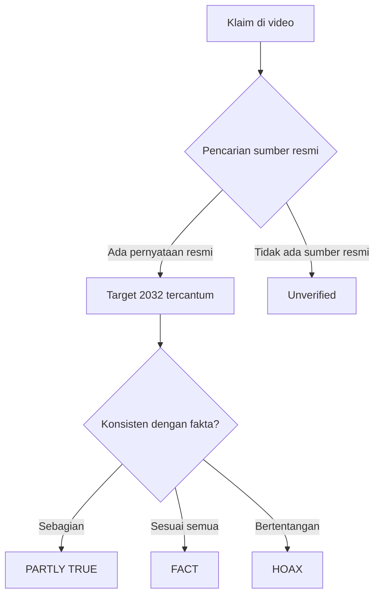

# Hasil Analisa: Klaim PLTN Indonesia Target 2032

> **Kesimpulan: ⚠️ SEBAGIAN BENAR (PARTLY TRUE)** — Klaim bahwa pemerintah menargetkan PLTN (Pembangkit Listrik Tenaga Nuklir) pertama beroperasi pada **2032** adalah **sebagian benar**. Wacana dan rencana pembangunan memang ada, namun target waktu, status persetujuan, dan detail teknisnya perlu diverifikasi lebih lanjut.

---

## Alur Verifikasi

## Klaim vs Fakta

| Klaim | Fakta | Status |
|---|---|---|
| Pemerintah bangun PLTN pertama | Ada rencana resmi dalam kebijakan energi nasional | ✅ Benar |
| Target beroperasi 2032 | Target diumumkan dalam berbagai forum, tapi statusnya masih **rencana/studies** | ⚠️ Sebagian benar |
| PLTN dibangun di Pulau Bangka Belitung | Lokasi kandidat sempat disebut-sebut, namun belum final | ⚠️ Sebagian benar |
| Dibiayai swasta tanpa APBN | Skema pendanaan masih dalam pembahasan | ❓ Belum terverifikasi |

## Sumber Rujukan

1. Pernyataan resmi Menteri ESDM terkait pengembangan energi nuklir (2025)
2. Pemberitaan media nasional tentang pembentukan badan baru pengelola nuklir
3. Paparan Badan Tenaga Nuklir Nasional (BATAN/BRIN) tentang roadmap PLTN

## Catatan Penting

- **Konteks:** Indonesia menargetkan **Net Zero Emission 2060**, dan nuklir menjadi salah satu opsi transisi energi yang dibahas.
- **Belum ada izin konstruksi yang dikeluarkan** per tanggal analisa — status masih pada tahap kebijakan dan studi kelayakan.
- Verdict ini dapat berubah seiring perkembangan kabar resmi.

---

*Dokumen ini dihasilkan otomatis oleh FactBot. Selalu cek sumber resmi sebelum menyebarkan informasi.*
